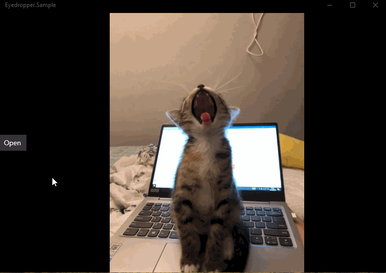

# Eyedropper
Eyedropper can pick up a color from anywhere in your application.
Zoom in to see every pixel of color to choose from.

## Download

UWP:download from [Nuget](https://www.nuget.org/packages/Eyedropper.UWP/)

## Using Eyedropper

```xaml
<uwp:EyedropperToolButton Target="{x:Bind Image}" />
```
## Sample App

[This is a sample app](https://github.com/HHChaos/Eyedropper/tree/master/Eyedropper.Sample)


